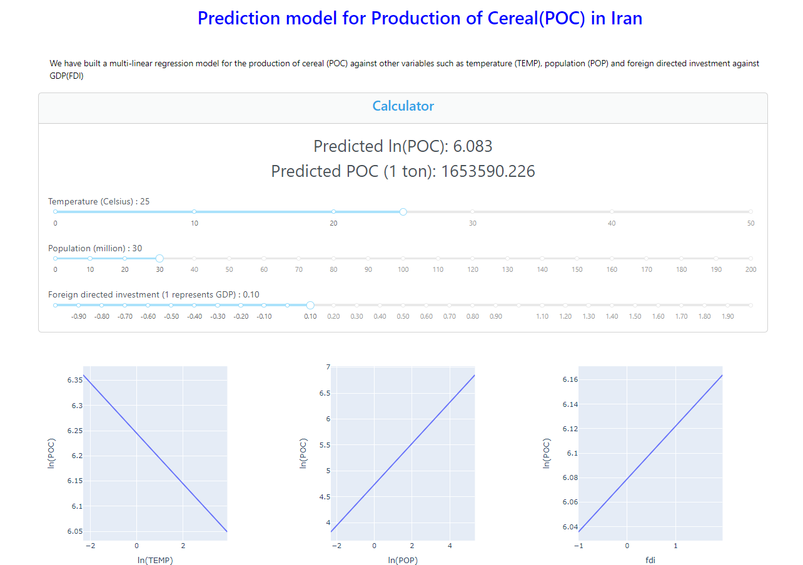

# Project Installation

Installation

## For Windows:

1. Change to the `controller` directory:
cd controller

2. Create a virtual environment named `myenv`:
python -m venv myenv

3. Activate the virtual environment:
.\myenv\Scripts\Activate

4. Install the required packages from `requirements.txt`:
pip install -r requirements.txt

## For Linux/MacOS:

1. Change to the `controller` directory:
cd controller

2. Create a virtual environment named `venv`:
python -m venv venv

3. Activate the virtual environment:
source venv/bin/activate

4. Install the required packages from `requirements.txt`:
pip install -r requirements.txt

# Acknowledgement

- [FAO - Agriculture Land Data](https://www.fao.org/faostat/en/#country/102)
- [World Bank - Climate Data (Rainfall and Temperature)](https://climateknowledgeportal.worldbank.org/country/iran-islamic-rep/climate-data-historical)
- [UN Population Data](https://data.un.org/Data.aspx?q=iran&d=PopDiv&f=variableID%3a12%3bcrID%3a364)
- [IMF - Private Debt Data](https://www.imf.org/external/datamapper/profile/IRN)
- [IMF - Unemployment Data](https://www.imf.org/en/Publications/WEO/weo-database/2023/October/download-entire-database)
- [Macrotrends - Iran Economic Growth Rate Data](https://www.macrotrends.net/countries/IRN/iran/economic-growth-rate) (Manually transcribed onto a CSV file due to the lack of a download button)
